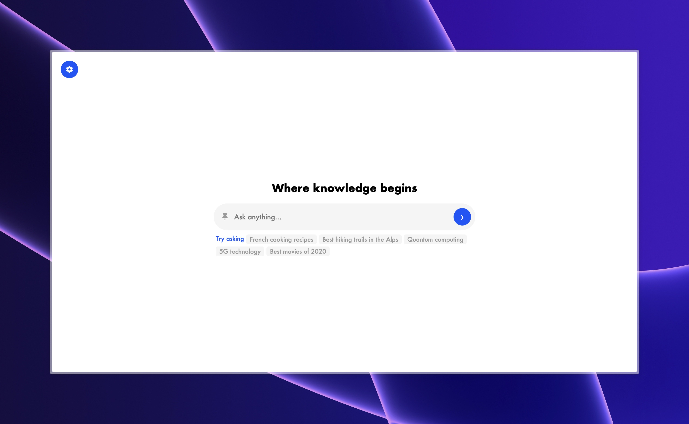
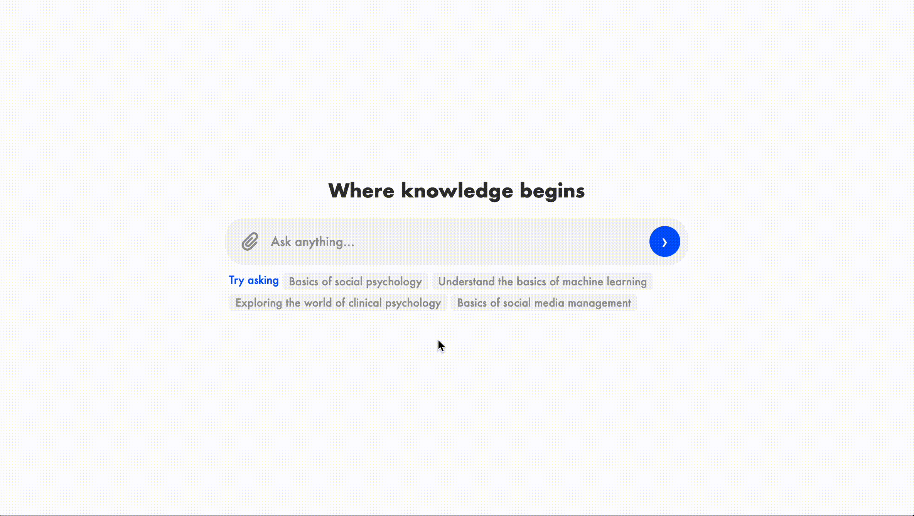

# Quantum

Quantum est une interface utilisateur intuitive et élégante conçue pour exploiter les capacités puissantes de l'API Gemini de Google. Cette application web vous permet d'interagir de manière fluide avec Gemini pour générer du contenu textuel et analyser des documents multimédias, facilitant ainsi la création et l'innovation à un niveau sans précédent.

## Interface




## Guide d'utilisation de Quantum

Pour utiliser Quantum, suivez ces étapes simples pour configurer et démarrer :

1. Accédez au [panel de contrôle](https://aistudio.google.com/app/apikey).
2. Cliquez sur "Create API key". Conservez cette clé, car vous en aurez besoin pour les requêtes API.
3. Dans le fichier HTML de Quantum, localisez la ligne suivante :

    ```javascript
    const API_KEY = "Your API key";
    ```

4. Remplacez `"Your API key"` par la clé d'API que vous avez générée.
5. Sauvegardez vos modifications.

Vous pouvez désormais lancer l'interface Quantum, saisir vos requêtes, et expérimenter les puissantes capacités de génération et d'analyse de contenu offertes par Gemini.

## Crédits

Pour toute question ou suggestion, rejoignez-moi sur Discord :

- Discord -> [Loucracotte](https://discord.gg/loucracotte/)