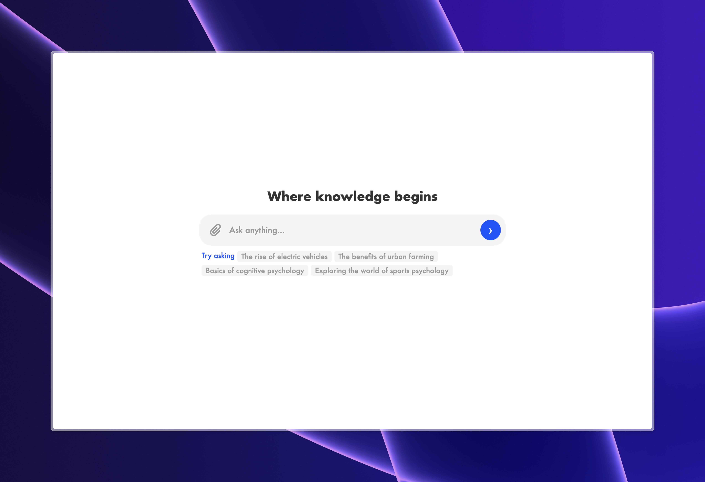

# Quantum
Quantum est une interface élégante et intuitive qui déverrouille le plein potentiel de Cohere, une plateforme d'intelligence artificielle. Conçu pour être convivial, Quantum vous offre un accès direct aux capacités de Cohere, vous permettant de créer et d'innover comme jamais auparavant.

# Interface 



# Guide d'utilisation de Quantum
Accédez au [tableau de bord Cohere](https://dashboard.cohere.com/).
Rendez-vous dans la section "API Keys" et générez une nouvelle clé d'API.
Copiez votre clé d'API.
Dans le code HTML de Quantum, localisez la ligne suivante :

```
const API_KEY = "Your api key";
```

Remplacez "Your api key" par votre clé d'API.
Enregistrez les modifications dans le code HTML.
Vous pouvez maintenant utiliser l'interface Quantum en entrant vos requêtes et en profitant des fonctionnalités de Quantum.

# Crédits

Discord -> [Loucracotte](https://discord.gg/loucracotte/)